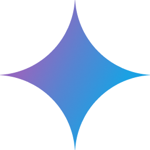

# SimulatorArena

**Are User Simulators Reliable Proxies for Multi-Turn Evaluation of AI Assistants?**

<div align="left">

[](https://www.simulatorarena.ai/)
[](https://arxiv.org/abs/2510.05444)
[](https://opensource.org/licenses/MIT)

</div>


## Welcome!

This repository contains the code and data for SimulatorArena, a framework that enables: (1) benchmarking AI assistants through multi-turn conversations with user simulators, and (2) evaluating the reliability of user simulators as proxies for human users.

## 🔧 Environment Setup

### Prerequisites
- Python 3.11 or higher
- API keys for the models you want to use (OpenAI, Anthropic, Google, Azure, etc.)

### Installation
```bash
# Clone the repository
git clone https://github.com/microsoft/SimulatorArena.git
cd SimulatorArena

# Install dependencies
pip install -r requirements.txt
```

### API Configuration
Create a `~/.env` file with your API keys:
```bash
# OpenAI
OPENAI_API_KEY=your_openai_key

# Anthropic (Claude)
ANTHROPIC_API_KEY=your_anthropic_key

# Google (Gemini)
GOOGLE_API_KEY=your_google_key

# Azure
AZURE_KEY=your_azure_key
AZURE_ENDPOINT=your_azure_endpoint

# Mistral
MISTRAL_API_KEY=your_mistral_key
```

## Repository Structure

### 📁 `data/`
Contains real human–AI dialogues for two tasks:
- **Math tutoring**: 450 conversations with math problems of varying difficulty (requires MATH dataset - see [data/README.md](data/README.md))
- **Document creation**: 459 conversations for creating blog posts, emails, and creative writing

Each conversation is fully annotated with quality ratings. The directory also includes GPT-4o extracted user profiles in the `user_simulator_profiles/` subfolder based on the conversations, which can be used in the user simulator to create more realistic user behaviors.

### 📁 `simulation/`
Framework for running user simulations and evaluating AI assistants through multi-turn conversations. Supports two primary use cases:
1. **Benchmarking assistant models** - Test new AI assistants with our best user simulator
2. **Developing user simulators** - Create and evaluate new user simulation approaches

See [simulation/README.md](simulation/README.md) for detailed documentation.

### 📁 `evaluation/`
Comprehensive evaluation pipelines for analyzing simulation results:
- **Math tutoring evaluation**: Correctness rates, interaction ratings, and F1 scores
- **Document creation evaluation**: Document quality ratings, interaction ratings, and correlation metrics

See [evaluation/math_tutoring/README.md](evaluation/math_tutoring/README.md) and [evaluation/document_creation/README.md](evaluation/document_creation/README.md) for task-specific details.

### 📁 `crowdsourcing/`
Resources for human evaluation:
- Web interface code for data collection
- Heroku deployment scripts
- Amazon Mechanical Turk job launching scripts

## 🚀 Quick Start Guide

**Note**: For math tutoring tasks, you must first download the MATH dataset and process the data. See [data/README.md](data/README.md) for detailed instructions.

### Use Case 1: Benchmark AI Assistant Models with User Simulator

In this use case, we use **user simulators to engage in conversations with AI assistants** and **evaluate the performance of AI assistants** based on these interactions:

- **Math Tutoring**: User simulator acts as a **student** seeking help, AI assistant acts as a **tutor** providing guidance
- **Document Creation**: User simulator acts as a **user wanting to create documents**, AI assistant acts as a **writing helper**

**Benchmark Data**:
- **Math Tutoring**: 50 math problems of varying difficulty
- **Document Creation**: 51 document topics (blog posts, emails, creative writing)
- **Data Source**: `data/math_tutoring_annotations_for_benchmarking.json` and `data/document_creation_annotations_for_benchmarking.json`

Follow these steps to benchmark your AI assistant models:

#### Step 1: Run Simulations with Your Assistant

**Quick Test** (1 conversation to verify setup):
```bash
cd simulation

# Math tutoring - quick test with 1 conversation
python user_simulation_math_tutoring.py \
    --version=zero-shot-cot-user-profile \
    --user_profile_version=interaction_style \
    --user_model=gpt-5-mini \
    --num_conversations=1 \
    --benchmarking \
    --allowed_models "gpt-5-mini,gpt-5-nano"

# Document creation - quick test with 1 conversation
python user_simulation_document_creation.py \
    --version=zero-shot-cot-user-profile \
    --user_profile_version=preference_and_writing_interaction_style \
    --user_model=gpt-5-mini \
    --num_conversations=1 \
    --benchmarking \
    --allowed_models "gpt-5-mini,gpt-5-nano"
```

**Full Benchmark** (all conversations):
```bash
# Math tutoring - full 50 conversations
python user_simulation_math_tutoring.py \
    --version=zero-shot-cot-user-profile \
    --user_profile_version=interaction_style \
    --user_model=gpt-5-mini \
    --num_conversations=-1 \
    --benchmarking \
    --allowed_models "gpt-5-mini,gpt-5-nano"

# Document creation - full 51 conversations
python user_simulation_document_creation.py \
    --version=zero-shot-cot-user-profile \
    --user_profile_version=preference_and_writing_interaction_style \
    --user_model=gpt-5-mini \
    --num_conversations=-1 \
    --benchmarking \
    --allowed_models "gpt-5-mini,gpt-5-nano"
```

**Notes**:
- Quick test uses `--num_conversations=1` for rapid verification
- Full benchmark uses `--num_conversations=-1` to run all 50 (math) or 51 (document) conversations
- User simulator model is `gpt-5-mini` for cost efficiency
- Replace assistant models in `--allowed_models` with your own model names

#### Step 2: Generate Termination Points of the Simulated Conversations
```bash
# Math tutoring
python terminate_conversation_math_tutoring.py \
    --annotation_id math_tutoring_annotations \
    --simulation_path "{user_model}/{simulation_name}.json"

# Document creation
python terminate_conversation_document_creation.py \
    --annotation_id document_creation_annotations \
    --simulation_path "{user_model}/{simulation_name}.json"
```

**Notes**:
- `annotation_id` is always `math_tutoring_annotations` or `document_creation_annotations` (NOT `*_for_benchmarking`)
- `simulation_path` should be `{user_model}/{simulation_name}.json` (e.g., `gpt-5-mini/zero-shot-cot_for_benchmarking.json`)
- The `_for_benchmarking` suffix is part of the simulation name, not the annotation_id
- The script constructs the full path as: `simulation/output/{annotation_id}/{simulation_path}`

#### Step 3: Run Evaluation Pipeline
```bash
# Math tutoring evaluation
cd ../evaluation/math_tutoring
bash ./evaluate_assistants.sh \
    --file_name "{user_model}/{simulation_name}" \
    --annotation_id "math_tutoring_annotations"

# Document creation evaluation
cd ../evaluation/document_creation
bash ./evaluate_assistants.sh \
    --file_name "{user_model}/{simulation_name}" \
    --annotation_id "document_creation_annotations"
```

**Note**: Use the same `{user_model}/{simulation_name}` from Steps 1-2 (e.g., `gpt-5-mini/zero-shot-cot-user-profile_up-interaction_style_for_benchmarking`)

#### Step 4: View Results
```bash
# Math tutoring - view performance metrics
python scripts/show_assistant_performance.py \
    --file_name "{user_model}/{simulation_name}" \
    --annotation_id "math_tutoring_annotations" \
    --sort_by "correctness"

# Document creation - view performance metrics
python scripts/show_assistant_performance.py \
    --file_name "{user_model}/{simulation_name}" \
    --annotation_id "document_creation_annotations" \
    --sort_by "document"
```

### Use Case 2: Develop and Evaluate User Simulators

In this use case, we **evaluate different user simulator configurations** by comparing how closely AI assistant performance with simulators matches AI assistant performance with real human users.

**Evaluation Method**:
- Run the **same AI assistants** with both user simulators and real humans
- Compare assistant performance metrics (ratings, correctness, F1 scores)
- Higher correlation with human baseline = better simulator

**Benchmark Data**:
- **Math Tutoring**: 450 real human-AI conversations across multiple assistants
- **Document Creation**: 459 real human-AI conversations across multiple assistants
- **Data Source**: `data/math_tutoring_annotations.json` and `data/document_creation_annotations.json` (WITHOUT `_for_benchmarking` suffix)

Follow these steps to evaluate your user simulator configurations:

#### Step 1: Run User Simulations

**Existing Simulator Strategies**: See `user_simulation_math_tutoring.sh` and `user_simulation_document_creation.sh` for examples of different simulation strategies (baseline, profile-based, with/without refinement, etc.). These scripts demonstrate various configurations but are resource-intensive to run in full.

**Quick Test** (1 conversation to verify setup):
```bash
cd simulation

# Math tutoring - test your simulator strategy
python user_simulation_math_tutoring.py \
    --version=zero-shot-cot-user-profile \
    --user_profile_version=interaction_style \
    --user_model=gpt-5-mini \
    --num_conversations=1

# Document creation - test your simulator strategy
python user_simulation_document_creation.py \
    --version=zero-shot-cot-user-profile \
    --user_profile_version=preference_and_writing_interaction_style \
    --user_model=gpt-5-mini \
    --num_conversations=1
```

**Full Simulation** (all conversations):
```bash
# Math tutoring - full 450 conversations
python user_simulation_math_tutoring.py \
    --version=zero-shot-cot-user-profile \
    --user_profile_version=interaction_style \
    --user_model=gpt-5-mini \
    --num_conversations=-1

# Document creation - full 459 conversations
python user_simulation_document_creation.py \
    --version=zero-shot-cot-user-profile \
    --user_profile_version=preference_and_writing_interaction_style \
    --user_model=gpt-5-mini \
    --num_conversations=-1
```

**Create Custom Simulator Prompts**:
```bash
# 1. Create your prompt templates in simulation/prompts/{task}/
#    - {your-strategy}-initial-query.txt  (for first query)
#    - {your-strategy}.txt                (for subsequent queries)

# 2. Run with your custom strategy
python user_simulation_math_tutoring.py \
    --version=your-strategy \
    --user_model=gpt-5-mini \
    --num_conversations=1  # Test first, then use -1 for full run
```

**Notes**:
- Start with `--num_conversations=1` for testing, then use `-1` for full evaluation (450 conversations for math, 459 for document creation)
- User simulator model is `gpt-5-mini` for cost efficiency
- Replace `--version` and `--user_profile_version` to test different strategies

#### Step 2: Generate Termination Points of the Simulated Conversations
```bash
# Math tutoring
python terminate_conversation_math_tutoring.py \
    --annotation_id math_tutoring_annotations \
    --simulation_path "{user_model}/{simulation_name}.json"

# Document creation
python terminate_conversation_document_creation.py \
    --annotation_id document_creation_annotations \
    --simulation_path "{user_model}/{simulation_name}.json"
```

**Notes**:
- `annotation_id` is always `math_tutoring_annotations` or `document_creation_annotations` (NOT `*_for_benchmarking`)
- `simulation_path` should be `{user_model}/{simulation_name}.json` (e.g., `gpt-5-mini/zero-shot-cot.json`)
- The `_for_benchmarking` suffix (if used) is part of the simulation name, not the annotation_id
- The script constructs the full path as: `simulation/output/{annotation_id}/{simulation_path}`

#### Step 3: Evaluate Simulator Performance
```bash
# Math tutoring evaluation
cd ../evaluation/math_tutoring
bash ./evaluate_simulators.sh \
    --file_name "{user_model}/{simulation_name}" \
    --annotation_id "math_tutoring_annotations"

# Document creation evaluation
cd ../evaluation/document_creation
bash ./evaluate_simulators.sh \
    --file_name "{user_model}/{simulation_name}" \
    --annotation_id "document_creation_annotations"
```

**Note**: Use the same `{user_model}/{simulation_name}` from Steps 1-2 (e.g., `gpt-5-mini/zero-shot-cot-user-profile_up-interaction_style`)

#### Step 4: View Results
```bash
# Math tutoring - view correlation metrics
python scripts/show_simulator_performance.py \
    --file_name "{user_model}/{simulation_name}" \
    --annotation_id "math_tutoring_annotations" \
    --aspect "both"

# Document creation - view correlation metrics
python scripts/show_simulator_performance.py \
    --file_name "{user_model}/{simulation_name}" \
    --annotation_id "document_creation_annotations" \
    --aspect "both"
```

## 📊 Key Metrics

### For Assistant Evaluation:
- **Math Tutoring**: Correctness rate (% of problems solved correctly), interaction quality (1-10 scale), conversation efficiency (turn count)
- **Document Creation**: Document quality (1-10 scale), interaction quality (1-10 scale), conversation efficiency (turn count)

### For Simulator Evaluation:
- **Correlation Metrics**: Spearman, Pearson, and Kendall correlations at instance/intermediate/system levels
- **F1 Scores** (Math tutoring only): Correctness prediction accuracy for student answers

## 📊 Benchmark Results

### Assistant Model Performance

Here are the latest results from evaluating various AI assistants using our best user simulators:

| Model | Math Turns | Math Interaction (1–10) | Math Correct Rate (%) | Doc Turns | Doc Interaction (1–10) | Doc Rating (1–10) |
|:------|-----------:|------------------------:|----------------------:|----------:|------------------------:|------------------:|
|  GPT-5 | 7.7 | 8.89 | 90.0 | 7.7 | 9.08 | 8.96 |
|  Claude 3.7 Sonnet | 7.8 | 8.70 | 90.0 | 7.6 | 9.10 | 8.73 |
|  Claude 4.1 Opus | 10.2 | 8.71 | 82.0 | 6.4 | 9.10 | 8.90 |
|  GPT-4 Turbo | 7.5 | 8.60 | 84.0 | 8.4 | 9.04 | 8.50 |
|  GPT-4o | 7.9 | 8.84 | 76.0 | 7.0 | 9.02 | 8.59 |
|  Claude 4 Sonnet | 10.6 | 8.74 | 70.0 | 6.9 | 9.07 | 8.80 |
|  GPT-4.1 | 10.3 | 8.87 | 76.0 | 7.5 | 9.08 | 8.47 |
|  Phi-4 | 6.0 | 8.66 | 84.0 | 7.2 | 8.96 | 8.39 |
|  Claude 3.5 Sonnet | 8.8 | 8.66 | 76.0 | 8.4 | 9.06 | 8.41 |
|  GPT-4o mini | 9.3 | 8.56 | 76.0 | 9.0 | 8.98 | 7.98 |
|  Gemini 2.5 Flash | 12.3 | 8.38 | 52.0 | 7.5 | 9.04 | 8.70 |
|  Gemini 2.5 Pro | 13.0 | 8.36 | 48.0 | 6.3 | 9.02 | 8.66 |
|  Gemini 2.0 Flash | 11.8 | 8.36 | 58.0 | 7.7 | 8.94 | 8.36 |
|  Mistral Large 2 | 10.0 | 8.08 | 64.0 | 7.8 | 8.98 | 8.25 |
|  Llama 3.3 70B | 8.2 | 8.26 | 68.0 | 8.2 | 8.88 | 7.92 |
|  Llama 3.1 70B | 8.7 | 7.70 | 70.0 | 8.8 | 8.86 | 8.00 |
|  Llama 3.1 8B | 10.8 | 6.48 | 46.0 | 8.8 | 8.82 | 7.53 |
|  Phi-3 Medium | 6.9 | 6.35 | 51.0 | 9.5 | 5.57 | 7.50 |

**Note:** Models are sorted by the mean z-score across all four metrics (interaction ratings and outcomes for both tasks). All models were evaluated in non-thinking mode. For GPT-5, we set the reasoning effort to minimal, and for Gemini 2.5 Pro, we used a thinking budget of 128 (the minimum allowed). OpenAI's reasoning models have their temperature fixed at 1.0 since they don't support temperature changes, while all other models were evaluated with temperature = 0.

### User Simulator Performance

The following figure shows the performance of different user simulator configurations across both tasks:


The chart compares various simulator strategies, from basic zero-shot generation to advanced profile-based approaches with different feature combinations. Higher correlation values indicate better alignment with human behavior.

## Acknowledgements
We thank Jonathan Zheng for beta testing this codebase prior to public release.

## Contributing

This project welcomes contributions and suggestions.  Most contributions require you to agree to a
Contributor License Agreement (CLA) declaring that you have the right to, and actually do, grant us
the rights to use your contribution. For details, visit https://cla.opensource.microsoft.com.

When you submit a pull request, a CLA bot will automatically determine whether you need to provide
a CLA and decorate the PR appropriately (e.g., status check, comment). Simply follow the instructions
provided by the bot. You will only need to do this once across all repos using our CLA.

This project has adopted the [Microsoft Open Source Code of Conduct](https://opensource.microsoft.com/codeofconduct/).
For more information see the [Code of Conduct FAQ](https://opensource.microsoft.com/codeofconduct/faq/) or
contact [opencode@microsoft.com](mailto:opencode@microsoft.com) with any additional questions or comments.

## Trademarks

This project may contain trademarks or logos for projects, products, or services. Authorized use of Microsoft
trademarks or logos is subject to and must follow 
[Microsoft's Trademark & Brand Guidelines](https://www.microsoft.com/en-us/legal/intellectualproperty/trademarks/usage/general).
Use of Microsoft trademarks or logos in modified versions of this project must not cause confusion or imply Microsoft sponsorship.
Any use of third-party trademarks or logos are subject to those third-party's policies.


## Citation
If you find SimulatorArena useful, please cite our paper:

```bibtex
@inproceedings{dou2025simulatorarena,
  title={SimulatorArena: Are User Simulators Reliable Proxies for Multi-Turn Evaluation of {AI} Assistants?},
  author={Dou, Yao and Galley, Michel and Peng, Baolin and Kedzie, Chris and Cai, Weixin and Ritter, Alan and Quirk, Chris and Xu, Wei and Gao, Jianfeng},
  booktitle={The 2025 Conference on Empirical Methods in Natural Language Processing},
  year={2025}
}
```